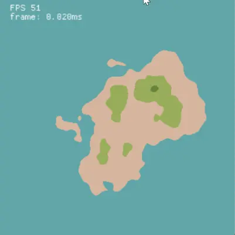

# Rust Playground

workspace where I dump all my little rust projects, mostly graphics related

## Verlet Physics [[source]](/verlet/) [[wasm]](https://mrmarble.dev/rust-playground/#verlet)

Simple physics simulation using the verlet algorithm. Made following this video: https://youtu.be/lS_qeBy3aQI

## Ants Simulation [[source]](/ants/) [[wasm]](https://mrmarble.dev/rust-playground/#ants)

Ant colony simulation that wander around seeking food and brings it back to the colony forming paths.
Inspiration: https://www.youtube.com/watch?v=81GQNPJip2Y

## 2D Island generation [[source]](/island/) [[wasm]](https://mrmarble.dev/rust-playground/#island)

2D Island generation with shadow casting to simulate 3D using perlin noise
Inspiration: https://www.youtube.com/watch?v=bMTeCqNkId8

